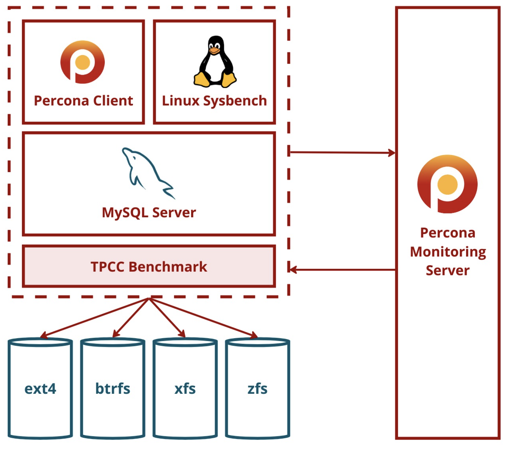
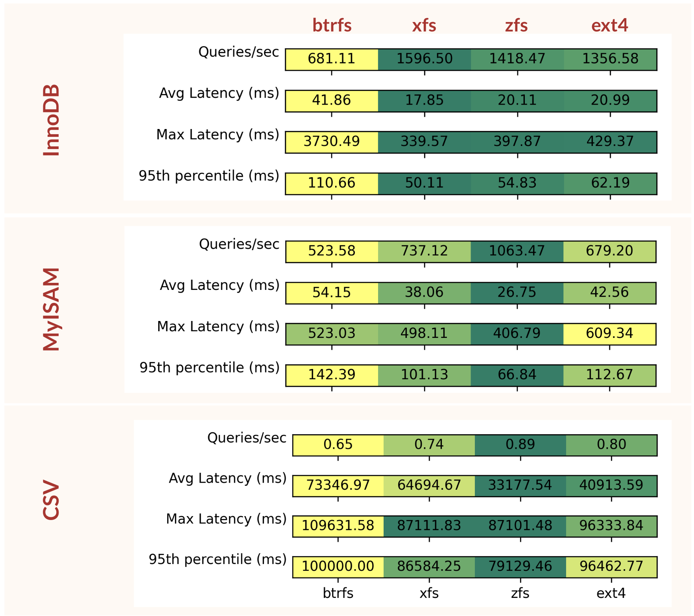

# fsql-perf
MySQL engine (InnoDB, MyISAM, CSV) performance analysis on Linux filesystems (ext4, btrfs, zfs, xfs)

## Setup
* Requires 4 additional disks attached to the machine to execute - each filesystem is installed on a new disk
* A Percona PMM server is also required (preferably on a different machine)
* Running `setup.sh` installs MySQL, filesystems, sysbench, Percona client, and other utilities
* To run the benchmark, run `perf.sh` after updating `nthreads`, `ntables`, `nscale`, `runtime`

## Metrics
* Running the benchmark generates sysbench files for each filesystem and engine. These can be parsed into a `csv` by running `clean.py`
* The timestamps between which the benchmarks ran are stored in `FS_engine_timestamp.csv`. These can be used to retrieve stats from the PMM server

# Results
### Summary

